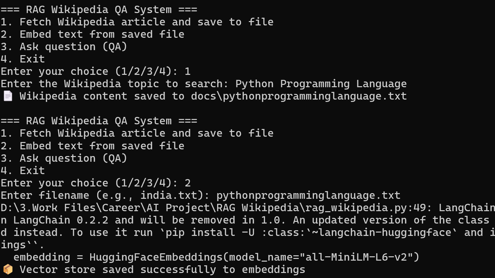
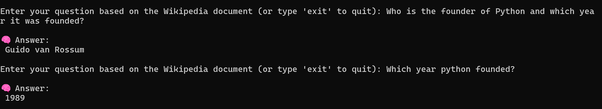

# 🧠 RAG Wikipedia QA (Offline)

A fully offline **Retrieval-Augmented Generation (RAG)** system that lets you **query any Wikipedia topic using a local LLM and vector store** — with no internet or API keys required.

---

## 🚀 Features

✅ Search any Wikipedia topic and save the content locally  
✅ Embed saved documents into a local FAISS vector store  
✅ Ask questions using Retrieval-Augmented Generation (RAG)  
✅ Runs fully **offline** — no API keys, no cloud dependency  
✅ Lightweight model (`sshleifer/tiny-gpt2`) — runs even on CPU  
✅ CLI interface for easy interaction  
✅ LangChain deprecation warnings cleaned  

---

## 🗂️ Folder Structure

RAG-Wikipedia-QA/
│
├── docs/ # Saved Wikipedia text files
├── embeddings/ # FAISS vector DBs saved here
├── rag_wikipedia.py # Main script
├── wiki.png # Image (Step 1 & 2)
├── QA.png # Image (Step 3)
└── README.md # This file

---

---

## 🔧 How It Works (Step-by-Step)

### ✅ Step 1 – Fetch Wikipedia Content

- User is prompted to enter a topic name (e.g., `India`, `Python programming language`)
- The script fetches the article summary and saves it as a `.txt` file under `/docs`


---

### ✅ Step 2 – Embed Text with FAISS

- Loads the saved `.txt` file
- Splits the text into chunks using LangChain’s `CharacterTextSplitter`
- Embeds the chunks into vectors using Hugging Face embeddings
- Stores them in a FAISS vector database (`.faiss` and `.pkl`) inside `/embeddings`

📸 Screenshot:  


---

### ✅ Step 3 – Ask a Question (RAG)

- Prompts user to enter the same filename
- Loads the vector store and retrieves relevant chunks based on the question
- Feeds context + question into a local GPT2 model
- Generates and returns an answer offline

📸 Screenshot:  


---

## 📦 Requirements

Install dependencies using:

```bash
pip install -r requirements.txt


👤 Author
Asif Noushad Sharafudeen
🔗 LinkedIn
🔗 GitHub